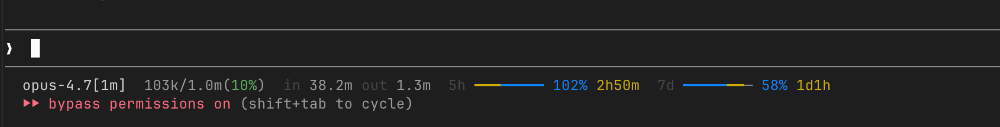

# claude-statusline-usage

A compact, info-dense status line for [Claude Code](https://claude.com/claude-code) that puts everything you actually look at — model, context budget, session tokens, and rate-limit windows — on one line.



## What you see

```
opus-4.7[1m]  120k/1.0m(12%)  in 4.3m out 38k  5h ━━━━─────  18% 3h12m  7d ━━━━━━──  62% 4d6h
└── model ──┘ └── context ──┘ └── session ──┘  └── 5-hour window ──┘    └── 7-day window ──┘
```

| Segment           | Meaning                                                                                         |
| ----------------- | ----------------------------------------------------------------------------------------------- |
| `opus-4.7[1m]`    | Active model. `[1m]` marker appears when you're on the 1M-context variant.                      |
| `120k/1.0m(12%)`  | Context used / context window. The `%` is color-coded (see legend below).                       |
| `in … out …`      | Cumulative input (incl. cache reads/writes) and output tokens for **this session**.             |
| `5h … %  …`       | 5-hour rate-limit window: bar overlays elapsed-time and used-quota, then `%` used + time left. |
| `7d … %  …`       | Same, for the 7-day window.                                                                     |

### The dual bar

Each rate-limit bar overlays two things on the same row:

- **time-elapsed** within the window (yellow)
- **quota used** within the window (blue)

Whichever percentage is *smaller* is drawn first, so the smaller bar's color "wins" the overlap region. Quick reads:

- **Mostly blue** → you're burning quota faster than the clock. Slow down or you'll hit the cap before the reset.
- **Mostly yellow** → you've got headroom. Quota is regenerating faster than you're spending it.
- **Even** → on pace.

### Context-usage health colors

The `%` next to context size changes color as you fill the window:

| Range      | Color       | Default threshold |
| ---------- | ----------- | ----------------- |
| healthy    | green       | `< 20%`           |
| warning    | orange      | `20% – 32%`       |
| hot        | orange-red  | `33% – 39%`       |
| critical   | red         | `>= 40%`          |

Thresholds are intentionally early — Claude Code starts compacting around 50%, and quality begins to drift well before that. Tune to your taste (see [Configuration](#configuration)).

## Install

Requires `jq` (`brew install jq` or `apt install jq`).

```bash
git clone https://github.com/motok2031/claude-statusline-usage.git
cd claude-statusline-usage
./install.sh
```

`install.sh` will:

1. Copy `statusline.sh` → `~/.claude/statusline-usage.sh`
2. Patch `~/.claude/settings.json` to point `statusLine.command` at it (backing up the original)
3. Print where everything landed

Restart Claude Code (or start a new session) and you should see the new status line.

### Manual install

If you don't trust install scripts (fair):

```bash
mkdir -p ~/.claude
cp statusline.sh ~/.claude/statusline-usage.sh
chmod +x ~/.claude/statusline-usage.sh
```

Then add to `~/.claude/settings.json`:

```json
{
  "statusLine": {
    "type": "command",
    "command": "~/.claude/statusline-usage.sh"
  }
}
```

## Configuration

Everything tunable lives at the top of `statusline.sh`. You can either edit the file directly, or override via env vars in your shell rc / Claude Code launcher:

| Env var              | Default | What it does                                |
| -------------------- | ------- | ------------------------------------------- |
| `CSU_BAR_WIDTH`      | `8`     | Width of each rate-limit bar in cells       |
| `CSU_HEALTH_WARN`    | `20`    | Context `%` at which `%` turns orange       |
| `CSU_HEALTH_HOT`     | `33`    | … turns orange-red                          |
| `CSU_HEALTH_CRIT`    | `40`    | … turns red                                 |
| `CSU_COLOR_MODEL`    | `252`   | 256-color code for the model name           |
| `CSU_COLOR_TIME`     | `33`    | 16-color code for the time-elapsed segment  |
| `CSU_COLOR_USAGE`    | `94`    | 16-color code for the quota-used segment    |
| `CSU_COLOR_EMPTY`    | `245`   | 256-color code for unfilled bar cells       |
| `CSU_COLOR_OK`       | `71`    | Context-% color, healthy                    |
| `CSU_COLOR_WARN`     | `208`   | Context-% color, warning                    |
| `CSU_COLOR_HOT`      | `202`   | Context-% color, hot                        |
| `CSU_COLOR_CRIT`     | `196`   | Context-% color, critical                   |

Example — bigger bars, stricter context thresholds:

```json
{
  "statusLine": {
    "type": "command",
    "command": "env CSU_BAR_WIDTH=12 CSU_HEALTH_WARN=15 ~/.claude/statusline-usage.sh"
  }
}
```

## Compatibility

- Tested on macOS (zsh/bash) and Linux (bash). Should work on anything POSIX with `bash`, `jq`, `awk`, `sed`.
- Requires a terminal with 256-color support (basically anything from this decade).
- Reads Claude Code's documented status-line stdin JSON — model, context window, rate limits, transcript path.

## Uninstall

```bash
rm ~/.claude/statusline-usage.sh
```

Then remove the `statusLine` block from `~/.claude/settings.json`.

## License

MIT.
